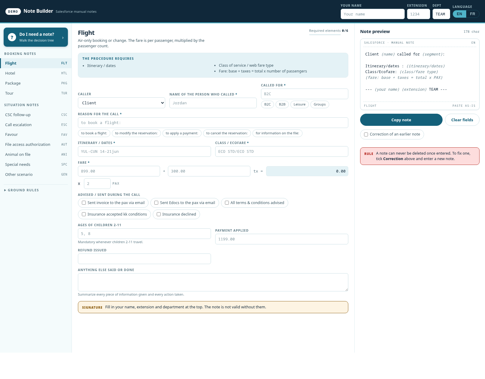

# Note Builder

A single-file, offline tool that turns a guided form into a correctly-formatted
Salesforce case note — bilingual (EN/FR), with a decision tree for *whether a
note is even required*, live validation against the procedure, and one-click
copy.

No build step, no dependencies, no network. Open the HTML file.

```bash
git clone <this repo> && cd note-builder
xdg-open note-builder.html     # or just double-click it
```

<p align="center">
  
</p>

---

## The problem it solves

Contact-centre agents write case notes by hand, under call pressure, in two
languages, against a procedure with different required elements per scenario. The
failure modes are consistent and expensive:

- a required element is missing, so the next agent has to phone the customer back;
- the note is written in a shape nobody can scan, so the next agent reads the
  whole thing;
- a mistake gets "fixed" by rewriting history, when the procedure says a note can
  never be deleted — only superseded by a correction.

This tool encodes the procedure instead of documenting it. You pick a scenario,
fill the fields it asks for, and the note builds itself in the shape the next
person expects.

---

## What it does

**A decision tree first.** "Do I need to leave a note?" walks the actual rule set
before you write anything. Most escalations start with a note that should not
exist, or one that should and doesn't.

**Ten scenarios, each with its own required set.** Four booking types — flight,
hotel, package, tour — and six situations: customer-service-claim follow-up,
call escalation, favour, file-access authorisation, animal on file, special
needs, plus a general fallback. Each declares its own fields, chips and validation.

**Live preview and a required-elements counter.** The note renders as you type,
in a monospace block that matches how it will look pasted into Salesforce, with a
character count and an explicit `Required elements 0/6` progress bar. You can see
that a note is incomplete before you send it.

**Bilingual by construction.** Every label, chip, placeholder and generated
sentence exists in English and French, switched at the header. The output note
changes language too — it is not a translated interface over an English note.

**Correction mode.** A checkbox that reformats the note as a correction of an
earlier one, because the procedure forbids deleting a note once entered. The
rule is stated on screen next to the control that implements it.

**Fare arithmetic.** Base + taxes = total, multiplied by passenger count, computed
in the form rather than in the agent's head at minute forty of a call.

Preferences (name, extension, department, language) persist in `localStorage`, so
the signature block is filled once and not retyped on every note.

---

## Also here: a training tracker

`HUB-training-tracker-DEMO.xlsx` — an 11-sheet Excel workbook that tracks agent
training across two sites, built for the same operation.

| Sheet | What it does |
| --- | --- |
| Accueil | Entry point, legend, "what do you want to do" links |
| Tableau de Bord | KPIs, skill coverage, training status, priority breakdown |
| Pipeline | Auto-assembled list of in-progress training |
| Skills · Formation Initiale · Agences & Après-vente · Evermont | Per-competency trackers |
| Planner | Cohort schedule builder — you type the modules, it builds the calendar |
| OBJECTIVES | Day-by-day target curve the priority formula reads |
| AGENTS | The roster the rest of the workbook joins against |
| Mode d'emploi | Instructions |

Gold cells are inputs; blue cells are computed. Marking a training "Terminé" in
its own tab removes it from the pipeline and moves the dashboard. About 57,000
formula cells do the joining, so the dashboard has no manual maintenance.

**The Planner is driven from the sheet, not from formulas.** Pick a cohort site
and a start date, then fill the activity template at the right: one row per
training day, with duration and notes. The calendar above it rebuilds from what
you typed — the number of training days is simply the number of rows you filled,
so a 10-day cohort and a 13-day cohort are the same sheet with different rows.
Renaming a site in the template header renames it in the cohort dropdown too.
Statutory holidays are entered in their own block and are skipped by the
`WORKDAY` calculation.

---

## Privacy

Both files are demo copies, de-identified on purpose.

- **No real people.** Every name in the workbook is generated. The sheet that
  previously carried a contact list — names against personal email addresses —
  was removed outright, and its strings were purged from the workbook's shared
  string table rather than merely orphaned.
- **No employer.** Company, product, internal-system, site, division, module and
  certification names were replaced with a coherent fictional set: a travel
  retailer called Quillridge, its own tools (QuillRes, QuillTour, QuillPay), an
  Académie e-learning platform, and competencies named for the desk they belong
  to. The training modules and their progress curves were rewritten, not just
  relabelled — including the day-by-day objective curve the priority rule reads.
- **No borrowed brand.** The interface palette is its own; the example values in
  the HTML tool — routes, hotel, tour name, file and case numbers, extension and
  department code — are invented.
- No customer data, no booking records, and no credentials were ever in either
  file.

Verified by re-scanning both artefacts, including every sheet's XML and the
cached formula results, for each original token: zero remaining.

---

## Notes on the build

One HTML file, ~1,270 lines, no framework. Scenario definitions are data — a
compact `F(id, labelEn, labelFr, opts)` field constructor and a per-scenario
`build()` that assembles the note — so adding a scenario is a data change, not a
UI change.

That was the point: the procedure changes, and when it does the person changing
it should not have to touch layout code.

---

## License

MIT — see [LICENSE](LICENSE).
